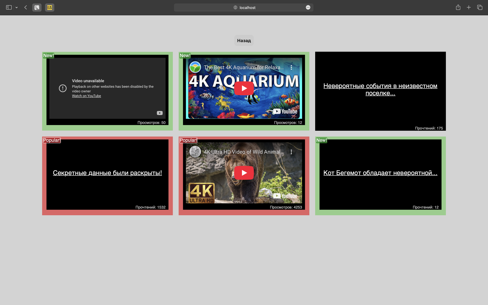
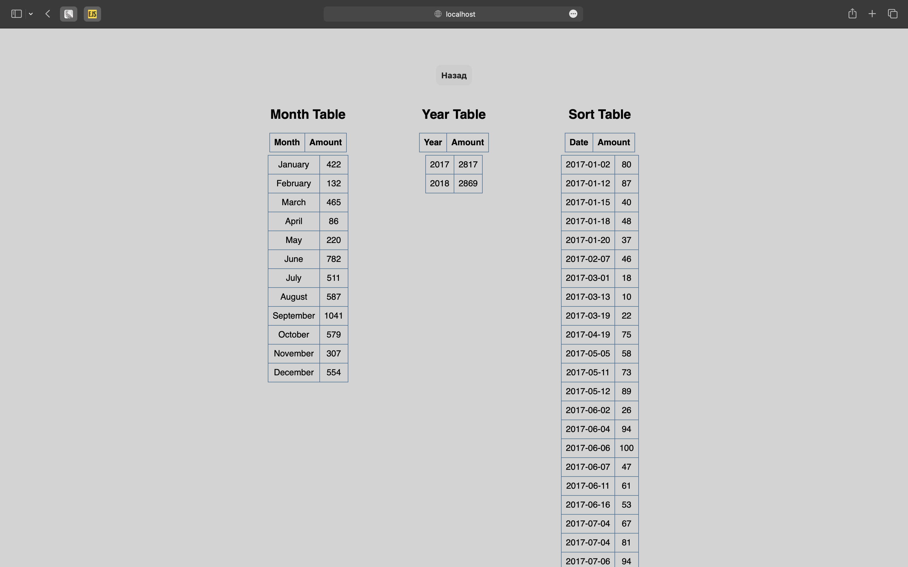

# HOC — Higher Order Components

### Задача 1 – Форматирование даты публикации
В данный момент выводится просто текущее значение. Пример: 2017-09-01 14:15:10. Решено изменять представление даты следующим образом в зависимости от его значения: 12 минут назад, если прошло меньше часа, 5 часов назад, если прошло больше часа, X дней назад, если больше суток.
(Реализация: используя HOC, производится обертка компонента DateTime)

### Задача 2 – Форматирование даты публикации
Мы решили улучшить отображение наших блоков таким образом, чтобы популярные статьи и видео, у которых 1000+ прочтений или просмотров, оборачивались в компонент Popular, а с количеством до 100 — в компонент New. Эти компоненты будут менять внешний облик блоков, привлекая внимание посетителей.
(Реализация: Используя HOC, Video и Article оборачиваются таким образом, чтобы при отображении в компоненте List они помещались внутрь требуемого компонента Popular или New.)

### Задача 3 – Агрегация данных для таблиц
Есть набор из трёх компонентов, которые выводят табличные данные:
- с группировкой по месяцам за текущий год,
- с группировкой по годам,
- с сортировкой по убыванию.

Реализация: Обернуть компоненты таблиц в HOC, который бы производил над данными операции, приводящие их к нужному виду. Также данные, которые группируются по дате, должны быть отсортированы по ней.

